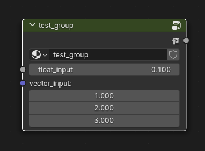

# NodeScript
Blenderのシェーダーノードエディタに、Pythonで書いたスクリプトから数式ノードを追加できるライブラリです  
Blender内のPythonにpipでインストールして使用してください

## インストール方法(Windows)
1. PowerShellを管理者権限で起動し、BlenderのPythonが置かれたディレクトリに移動  
   デフォルトだと`C:\Program Files\Blender Foundation\Blender 4.0\4.0\python\bin`  
   Blenderのバージョンは各自読み替えてください
     ```
     $ cd "C:\Program Files\Blender Foundation\Blender 4.0\4.0\python\bin"
     ```
1. BlenderのPythonに`pip`がインストールされていない場合は`pip`をインストール
    ```
    $ .\python.exe -m ensurepip
    ```
1. githubのリポジトリから`node_script`を`pip`でインストール
    ```
    $ .\python.exe -m pip install git+https://github.com/iodoform/NodeScript.git
    ```
<!--
1. （任意だけど推奨）Blender上だけでなくコードエディタ上でも使えたほうが便利なので、普段使用しているPythonにもインストールしてください  
   `node_script`の後ろに`[edit]`とつけると、`bpy`のコードエディタ上でのコード補間用モジュールである`fake-bpy-module`も一緒にインストールされます
   ```
    $ pip install node_script[edit]
   ```
-->
## 使用方法
関数と演算子を使って数式ノードおよびベクトル演算ノードの接続を表現できます  
### 例

```python
from node_script import *
vec = vector3(1,2,3,'vector_input')
val = value(0.1,'float_input')
vector_multiply = vmul(val+1,vec)
vector_multiply.x + 100
```


`make_group()`関数を使って、自分で作成した数式をグループ化可能  
グループ化時には`value`および`vector3`で作成されたノードは自動的にグループの入力に変換されます
```python
from node_script import *
vec = vector3(1,2,3,'vector_input')
val = value(0.1,'float_input')
vector_multiply = vmul(val+1,vec)
group = vector_multiply.x + 100
make_group(group,'test_group')
```

### 注意点
以下のような数式はエラーになります。
```python
from node_script import *
vec = vector3(1,2,3,'vector_input')
val = value(0.1,'float_input')
vector_multiply = vmul(val+1,vec)
group = vector_multiply + 100　　# エラー
```
`vector_multiply + 100`のように、ベクトルとスカラーを足す場合は出力がベクトルになるかスカラーになるか曖昧であるため、
このような計算をしたい場合は`add(vector_multiply,100)`または`vadd(vector_multiply,100)`のように関数を使用して、出力を明示してください
